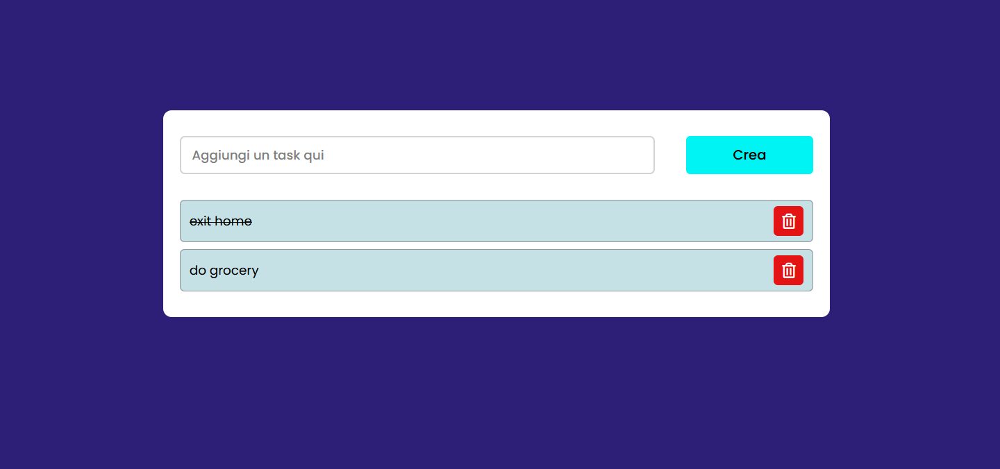

# ✅ Task List (aka The Obligatory Developer Rite)

> “It’s not a real GitHub profile if there isn’t at least one ToDo app.” 🙃

---

Welcome to my extremely essential, historically accurate, and utterly unsurprising **Task List project**.  
Built with pure, unfiltered JavaScript and CSS, because… well, sometimes you just gotta keep it old-school.  
Don’t expect React, TypeScript, or any modern magic here — just good old HTML, CSS, and JS doing their thing.

---

## 🤷 Why does this exist?

- Because every dev portfolio in the universe has at least one.
- Because you never forget your first `.push()` to an array.
- Because I needed *something* to pin here while my more serious project is on the way.

---

## 🚀 Features (if you squint)

- [x] Add tasks (wow!)
- [x] Remove tasks (incredible!)
- [x] Mark tasks as completed (groundbreaking!)
- [x] Gaze upon your productivity (or lack thereof)

---

## 🎨 Preview



---

## 🛠️ Tech Stack

- Vanilla JavaScript
- CSS
- Pure nostalgia

---

## 📦 Getting Started

Want to relive your first steps as a web dev? Clone and open the HTML file.  
No frameworks, no build tools, no nonsense.

```bash
git clone https://github.com/Uesone/tasklist.git
cd tasklist
# Open index.html in your browser
```
💤 What’s next?
---
Soon to be replaced by an actual, modern project.

Until then, please enjoy this sacred artifact of the web dev journey.

Made with 0 frameworks, 0 build steps, and 100% developer tradition compliance.
By Umberto Amoroso
